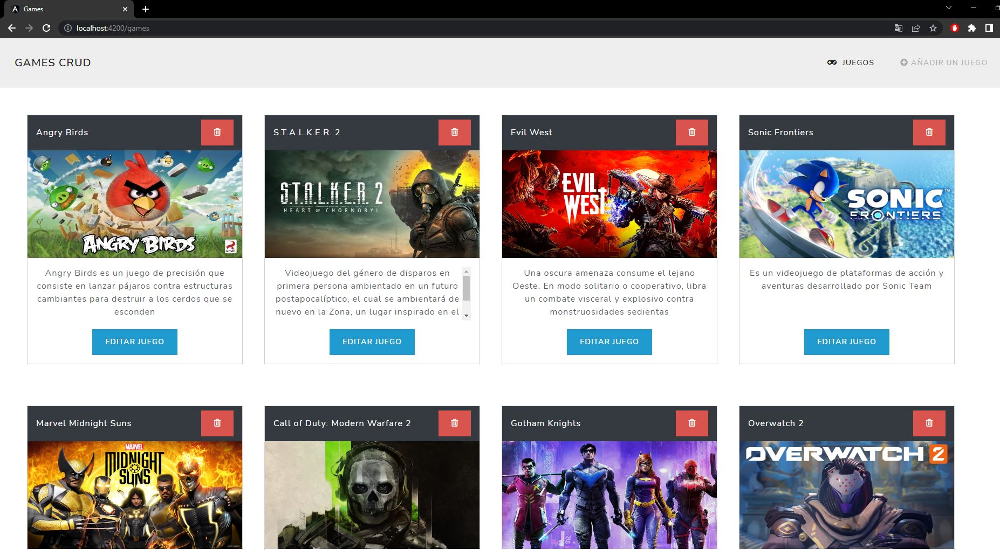

# CRUD de Juegos en Angular
Aplicación para la administración de información de juegos, cada juego cuenta con título, descripción e imagen, se permite la realización de acciones de listar, crear, editar y eliminar juegos, para desarrollar la aplicación web se usa Angular, Node.js y base de datos MySQL.

### Vista principal

### Ejecución de la app
En la carpeta server ejecutar `npm run dev` y `npm run build`.  
En la carpeta client ejecutar `ng serve`.

